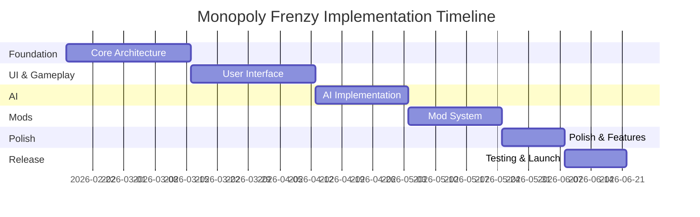

# Monopoly Frenzy - Implementation Plan

**Date**: 2026-02-16  
**Author**: Senior Business Analyst Agent  
**Status**: Approved  
**Version**: 1.0  
**Related Documents**:
- [Architecture Summary](../specifications/ARCHITECTURE-SUMMARY.md)
- [System Overview](../specifications/architecture/monopoly-frenzy-system-overview.md)
- [ADR-001: Technology Stack](../specifications/decisions/adr-001-technology-stack-selection.md)
- [ADR-002: Game State Management](../specifications/decisions/adr-002-game-state-management.md)
- [ADR-003: Mod Support](../specifications/decisions/adr-003-mod-support-architecture.md)

---

## Executive Summary

This implementation plan provides a detailed, phase-by-phase roadmap for building Monopoly Frenzy, a customizable Monopoly clone for Windows with AI opponents, mod support, and enhanced features. The plan is structured to enable iterative development and testing, with each phase delivering functional, testable increments.

**Key Objectives**:
- Build production-ready Monopoly game in 18 weeks
- Support 2-6 players (human and AI mix)
- Provide comprehensive mod system for customization
- Deliver polished user experience with animations and audio
- Ensure 80%+ test coverage on game logic
- Maintain 60 FPS on target hardware

**Technology Stack**: Unity 2022 LTS with C# (.NET 6/7)

**Architecture Approach**: 
- State Machine for game flow control
- Command Pattern for player actions (enables undo/redo, networking)
- Pure C# game logic (testable without Unity dependencies)
- Event-driven UI updates
- Data-driven mod system (JSON + assets)

---

## Table of Contents

1. [Implementation Phases Overview](#implementation-phases-overview)
2. [Phase 1: Foundation & Core Architecture](#phase-1-foundation--core-architecture-weeks-1-4)
3. [Phase 2: User Interface & Basic Gameplay](#phase-2-user-interface--basic-gameplay-weeks-5-8)
4. [Phase 3: AI System](#phase-3-ai-system-weeks-9-11)
5. [Phase 4: Mod Support](#phase-4-mod-support-weeks-12-14)
6. [Phase 5: Polish & Enhanced Features](#phase-5-polish--enhanced-features-weeks-15-16)
7. [Phase 6: Testing, Optimization & Release](#phase-6-testing-optimization--release-weeks-17-18)
8. [Success Metrics & Quality Gates](#success-metrics--quality-gates)
9. [Risk Management](#risk-management)
10. [Dependencies & Prerequisites](#dependencies--prerequisites)
11. [Team Structure & Responsibilities](#team-structure--responsibilities)

---

## Implementation Phases Overview

### Timeline: 18 Weeks (4.5 Months)



### Phase Summary

| Phase | Duration | Focus | Deliverable | Status |
|-------|----------|-------|-------------|--------|
| **Phase 1** | Weeks 1-4 | Core Architecture | Working game logic, testable | 📋 Planned |
| **Phase 2** | Weeks 5-8 | UI & Gameplay | Playable game with UI | 📋 Planned |
| **Phase 3** | Weeks 9-11 | AI System | Three AI difficulty levels | 📋 Planned |
| **Phase 4** | Weeks 12-14 | Mod Support | Working mod system | 📋 Planned |
| **Phase 5** | Weeks 15-16 | Polish | Animations, sound, tutorial | 📋 Planned |
| **Phase 6** | Weeks 17-18 | Release | Tested, optimized product | 📋 Planned |

### Iterative Development Approach

Each phase follows the same development cycle:
1. **Plan** (10% of phase time) - Detailed requirements and design
2. **Build** (50% of phase time) - Implementation
3. **Test** (30% of phase time) - Unit, integration, playtesting
4. **Review** (10% of phase time) - Code review, retrospective, adjustments

### Build vs. Buy vs. Modify

| Component | Decision | Rationale |
|-----------|----------|-----------|
| **Game Engine** | Use: Unity 2022 LTS | Proven for board games, excellent 2D tools |
| **Tweening** | Use: DOTween | Industry standard, performant |
| **JSON Parser** | Use: Newtonsoft.Json | Robust, well-tested |
| **Testing** | Use: NUnit | Unity-compatible |
| **State Machine** | Build: Custom | Specific to our game flow |
| **Game Logic** | Build: Custom | Core IP and rules |
| **UI Framework** | Use: Unity UI | Built-in, proven |

---

## Phase 1: Foundation & Core Architecture (Weeks 1-4)

### Objectives

Establish the technical foundation and implement core game logic without UI dependencies. This phase creates the "brain" of the game - all rules, state management, and business logic.

**Goal**: A developer can write unit tests that play complete Monopoly games programmatically.

### Epic: Core Game Logic System

#### User Stories

##### User Story 1.1: Game State Management
**As a** game developer  
**I want to** have a centralized game state that tracks all game data  
**So that** the game state can be easily tested, saved, and synchronized with UI

**Acceptance Criteria:**
- [ ] GameState class contains all game data (board, players, current turn, phase)
- [ ] GameState is serializable to JSON
- [ ] GameState can be cloned for AI evaluation
- [ ] GameState publishes events when changed
- [ ] Unit tests can create and manipulate GameState
- [ ] No Unity dependencies in GameState class
- [ ] Memory usage under 10 MB for typical game

**Priority**: Critical  
**Estimated Complexity**: Medium

---

##### User Story 1.2: State Machine for Game Flow
**As a** game developer  
**I want to** implement a state machine for game flow  
**So that** game phases and turn sequences are clearly defined and testable

**Acceptance Criteria:**
- [ ] State machine with states: MainMenu, GameSetup, Playing, GameOver
- [ ] Turn state machine: RollDice, MovePiece, TakeTurnAction, EndTurn
- [ ] State transitions are validated and logged
- [ ] Each state has clear Enter(), Update(), Exit() methods
- [ ] Invalid state transitions throw exceptions
- [ ] State machine is testable without Unity
- [ ] State transitions complete in <1ms

**Priority**: Critical  
**Estimated Complexity**: Medium

---

##### User Story 1.3: Command Pattern for Actions
**As a** game developer  
**I want to** implement all player actions as command objects  
**So that** actions can be undone, replayed, and sent over network (future)

**Acceptance Criteria:**
- [ ] Base ICommand interface with Execute() and Undo()
- [ ] Commands implemented: RollDiceCommand, MoveCommand, BuyPropertyCommand, PayRentCommand, DrawCardCommand, TradeCommand, MortgageCommand, UnmortgageCommand, BuyHouseCommand, EndTurnCommand
- [ ] Commands validate preconditions before executing
- [ ] Commands return result objects (success/failure with reason)
- [ ] Commands are serializable to JSON
- [ ] Command history stored for undo/replay
- [ ] Commands execute in <1ms each
- [ ] 100% unit test coverage on all commands

**Priority**: Critical  
**Estimated Complexity**: Complex

---

##### User Story 1.4: Monopoly Rules Engine
**As a** game developer  
**I want to** implement all standard Monopoly rules accurately  
**So that** the game plays correctly and validates all actions

**Acceptance Criteria:**
- [ ] Rule validation for property purchases (player has money, property available)
- [ ] Rent calculation (base rent, with houses/hotels, mortgage status)
- [ ] House/hotel purchase rules (must own monopoly, even building, availability)
- [ ] Trading rules (multi-property trades, money included, all parties agree)
- [ ] Bankruptcy rules (player elimination, asset distribution)
- [ ] Jail rules (roll doubles, pay $50, use Get Out of Jail Free card, 3 turns)
- [ ] Chance and Community Chest card effects
- [ ] Pass GO ($200 collection)
- [ ] Landing on Free Parking (configurable)
- [ ] Auction system (when player declines purchase)
- [ ] Mortgage system (borrow 50% value, pay back 60%)
- [ ] Rules are configurable for house rules
- [ ] 90%+ test coverage on rules

**Priority**: Critical  
**Estimated Complexity**: Complex

---

##### User Story 1.5: Event System
**As a** game developer  
**I want to** implement an event system for game state changes  
**So that** UI, audio, and other systems can react to game events

**Acceptance Criteria:**
- [ ] Event bus implementation with publish/subscribe
- [ ] Events defined for all game state changes (PlayerMoved, PropertyPurchased, MoneyTransferred, PlayerBankrupt, etc.)
- [ ] Events carry sufficient data for observers
- [ ] Events are fired after state changes (not before)
- [ ] Event subscriptions can be added/removed dynamically
- [ ] Event system has negligible performance overhead (<0.1ms)
- [ ] Events are thread-safe
- [ ] Unit tests can observe and verify events

**Priority**: High  
**Estimated Complexity**: Medium

---

### Functional Requirements

#### FR1.1: Game Board Representation
**Description**: The game board consists of 40 spaces in a rectangular path.

**Rationale**: Core to Monopoly gameplay

**Dependencies**: None

**Behavior Specification:**
- Given the game initializes
- When the board is created
- Then 40 spaces exist in sequence
- And spaces have correct types (Property, Railroad, Utility, Tax, Chance, Community Chest, Corner spaces)
- And property spaces have correct prices, rents, and colors

**Edge Cases:**
- Invalid space index returns null or throws exception
- Space properties are immutable once created
- Board configuration can be loaded from mod data

**Testing:**
- Unit test verifies 40 spaces created
- Unit test verifies each space type is correct
- Unit test verifies property prices match standard Monopoly

---

#### FR1.2: Player Management
**Description**: Support 2-6 players with names, tokens, and financial tracking.

**Rationale**: Core game requirement

**Dependencies**: GameState

**Behavior Specification:**
- Given a game is being set up
- When players are added
- Then each player has unique ID, name, token, starting money ($1500 standard)
- And player positions start at space 0 (GO)
- And player turn order is established

**Edge Cases:**
- Cannot add more than 6 players
- Cannot add fewer than 2 players
- Player names can be duplicated (add number suffix)
- Player tokens must be unique

**Testing:**
- Unit test player creation
- Unit test player validation rules
- Unit test money transactions
- Unit test property ownership

---

#### FR1.3: Property Ownership and Transactions
**Description**: Players can buy, sell, mortgage, and trade properties.

**Rationale**: Core Monopoly mechanic

**Dependencies**: GameState, Command Pattern

**Behavior Specification:**
- Given a player lands on an unowned property
- When the player chooses to buy
- Then money is deducted
- And property ownership transfers
- And PropertyPurchased event fires
- And the deed is added to player's portfolio

**Edge Cases:**
- Player doesn't have enough money - purchase denied
- Property already owned - no purchase option
- Property mortgaged - owner can unmortgage
- Property in trade - temporarily locked

**Testing:**
- Unit test property purchase flow
- Unit test mortgage/unmortgage
- Unit test property trading
- Unit test auction system

---

#### FR1.4: Turn Management
**Description**: Manage turn sequence and player actions within turns.

**Rationale**: Controls game flow

**Dependencies**: State Machine, Command Pattern

**Behavior Specification:**
- Given a player's turn begins
- When the player rolls dice
- Then piece moves
- And turn actions available based on landing space
- And turn progresses through defined phases
- And turn ends when player chooses or mandatory actions complete

**Edge Cases:**
- Roll doubles - get another turn (max 3)
- Roll doubles three times - go to jail
- Land on GO - collect $200
- Pass GO - collect $200
- Player bankrupt - eliminate and skip future turns

**Testing:**
- Unit test turn progression
- Unit test doubles handling
- Unit test turn phase transitions
- Unit test bankruptcy during turn

---

### Non-Functional Requirements

#### NFR1.1: Performance
- Game state updates complete in <1ms
- Command execution in <1ms
- Event publishing in <0.1ms
- Memory usage under 10 MB for game logic
- No garbage collection pressure during gameplay (minimal allocations)

#### NFR1.2: Testability
- 80%+ code coverage on game logic
- All game logic in pure C# classes (no Unity dependencies)
- Dependency injection for external dependencies
- Deterministic behavior (same inputs = same outputs)
- Mock-friendly interfaces

#### NFR1.3: Maintainability
- SOLID principles followed
- Clear class and method naming
- XML documentation comments on public APIs
- Design patterns documented
- Code review for all implementations

#### NFR1.4: Extensibility
- Game rules configurable via strategy pattern
- New commands easily added
- New space types supported
- House rules implementable without core changes

---

### Unity Implementation Guidance

#### Project Structure
```
Assets/
├── Scripts/
│   ├── Core/
│   │   ├── GameState.cs
│   │   ├── Board.cs
│   │   ├── Player.cs
│   │   ├── Property.cs
│   │   └── Space.cs
│   ├── StateMachine/
│   │   ├── IGameState.cs
│   │   ├── StateMachine.cs
│   │   ├── States/
│   │   │   ├── MainMenuState.cs
│   │   │   ├── GameSetupState.cs
│   │   │   ├── PlayingState.cs
│   │   │   └── GameOverState.cs
│   │   └── TurnStates/
│   │       ├── RollDiceState.cs
│   │       ├── MovePieceState.cs
│   │       ├── TakeTurnActionState.cs
│   │       └── EndTurnState.cs
│   ├── Commands/
│   │   ├── ICommand.cs
│   │   ├── CommandResult.cs
│   │   ├── RollDiceCommand.cs
│   │   ├── MoveCommand.cs
│   │   ├── BuyPropertyCommand.cs
│   │   └── [other commands...]
│   ├── Rules/
│   │   ├── IRuleSet.cs
│   │   ├── StandardRules.cs
│   │   ├── PropertyRules.cs
│   │   ├── RentCalculator.cs
│   │   └── BankruptcyHandler.cs
│   └── Events/
│       ├── IEventBus.cs
│       ├── EventBus.cs
│       └── GameEvents.cs
└── Tests/
    ├── EditMode/
    │   ├── GameStateTests.cs
    │   ├── CommandTests.cs
    │   ├── RulesTests.cs
    │   └── StateMachineTests.cs
    └── PlayMode/
        └── IntegrationTests.cs
```

#### Recommended Unity Components

**None yet** - Phase 1 is pure C# with no Unity dependencies. This enables:
- Fast unit testing (no Unity Editor required)
- Command-line testing in CI/CD
- High test coverage
- Clear separation of concerns

#### Design Patterns Applied

1. **State Pattern**: Game flow and turn management
   - Context: GameStateMachine
   - States: MainMenuState, PlayingState, etc.
   - Clear transitions and validation

2. **Command Pattern**: All player actions
   - ICommand interface
   - Execute() and Undo() methods
   - Command history for replay

3. **Observer Pattern**: Event system
   - EventBus for loose coupling
   - Publishers and subscribers
   - Typed events for safety

4. **Strategy Pattern**: Rule variants
   - IRuleSet interface
   - StandardRules, CustomRules
   - Swappable at game start

5. **Factory Pattern**: Object creation (prepared for Phase 4)
   - PropertyFactory
   - CardFactory
   - Validate and construct

---

### Testing Requirements

#### Unit Test Scenarios

**Test Suite 1: GameState Tests**
- Create initial game state
- Add/remove players
- Serialize to JSON and deserialize
- Clone game state
- Verify immutability of certain properties
- Test event firing on state changes

**Test Suite 2: Command Tests**
- Execute each command type successfully
- Undo each command type
- Validate preconditions (should fail when invalid)
- Serialize commands to JSON
- Command history tracking
- Edge cases for each command

**Test Suite 3: Rules Tests**
- Property purchase validation
- Rent calculation (all variants)
- House/hotel purchase rules
- Trading validation
- Bankruptcy processing
- Jail mechanics
- Chance/Community Chest effects
- Pass GO mechanics
- Auction system
- Mortgage rules

**Test Suite 4: State Machine Tests**
- Valid state transitions
- Invalid state transitions (should throw)
- State entry/exit actions
- Turn phase progression
- Doubles handling
- Game over conditions

**Test Suite 5: Event System Tests**
- Publish and subscribe to events
- Multiple subscribers
- Unsubscribe
- Event data correctness
- Event order

#### Integration Test Scenarios

**Integration Test 1: Complete Game Simulation**
- Setup: Initialize game with 4 AI players
- Steps: Simulate complete game programmatically
- Expected: Game completes with winner
- Pass criteria: No exceptions, valid game end state

**Integration Test 2: Command Sequence**
- Setup: Create game state
- Steps: Execute sequence of commands representing typical turn
- Expected: State changes correctly, events fire in order
- Pass criteria: Final state matches expected

**Integration Test 3: Bankruptcy Flow**
- Setup: Game with player near bankruptcy
- Steps: Force player to owe more than they can pay
- Expected: Bankruptcy processed, assets distributed, player eliminated
- Pass criteria: Game continues with remaining players

#### Performance Testing

**Performance Test 1: State Operations**
- Measure time for state updates
- Target: <1ms per operation
- Test with full game state (6 players, all properties)

**Performance Test 2: Command Execution**
- Measure time for each command type
- Target: <1ms per command
- Test 1000 commands in sequence

**Performance Test 3: Event System**
- Measure event publish time
- Target: <0.1ms per event
- Test with 100 subscribers

**Performance Test 4: Memory Usage**
- Measure memory for game state
- Target: <10 MB
- Profile for memory leaks

#### Code Coverage Targets

- Game Logic Core: 90%+
- Commands: 100%
- Rules Engine: 90%+
- State Machine: 85%+
- Event System: 80%+
- **Overall Phase 1: 85%+**

---

### Implementation Checklist

#### Week 1: Project Setup & Core Data Structures
- [ ] Create Unity 2022 LTS project
- [ ] Set up folder structure
- [ ] Configure .NET 6/7 compatibility
- [ ] Install NUnit test framework
- [ ] Create GameState class with basic properties
- [ ] Implement Board class with 40 spaces
- [ ] Implement Player class
- [ ] Implement Property class
- [ ] Write initial unit tests for data structures
- [ ] Set up CI/CD for automated testing

#### Week 2: State Machine & Commands Foundation
- [ ] Implement IGameState interface
- [ ] Create StateMachine class
- [ ] Implement basic game flow states (Menu, Setup, Playing, GameOver)
- [ ] Implement ICommand interface
- [ ] Create CommandResult class
- [ ] Implement 3-5 basic commands (Roll, Move, Buy, Pay, EndTurn)
- [ ] Write unit tests for state machine
- [ ] Write unit tests for commands
- [ ] Document state transitions

#### Week 3: Rules Engine & Game Logic
- [ ] Implement property purchase validation
- [ ] Implement rent calculation
- [ ] Implement house/hotel purchase rules
- [ ] Implement trading logic
- [ ] Implement bankruptcy handling
- [ ] Implement jail mechanics
- [ ] Implement Chance/Community Chest card system
- [ ] Write comprehensive rules tests
- [ ] Document all game rules

#### Week 4: Event System & Polish
- [ ] Implement EventBus class
- [ ] Define all game events
- [ ] Integrate events into state changes
- [ ] Implement remaining commands (Mortgage, Unmortgage, BuyHouse, Trade)
- [ ] Write integration tests (full game simulation)
- [ ] Performance profiling and optimization
- [ ] Code review and refactoring
- [ ] Update documentation

---

### Acceptance Criteria for Phase 1 Completion

**Phase 1 is complete when:**
- [ ] All game logic implemented in pure C# (no UI)
- [ ] 85%+ code coverage on game logic
- [ ] All unit tests pass
- [ ] Integration test (full game simulation) passes
- [ ] Performance targets met (<1ms operations)
- [ ] Memory usage under 10 MB
- [ ] Code reviewed and approved
- [ ] Documentation complete
- [ ] Zero critical bugs
- [ ] State machine visualized and documented
- [ ] All standard Monopoly rules implemented correctly
- [ ] Developer can run automated game simulations

**Quality Gates:**
- ✅ Builds successfully without errors
- ✅ All tests pass (100% success rate)
- ✅ Code coverage meets targets
- ✅ Performance benchmarks met
- ✅ Code review completed
- ✅ Documentation reviewed

**Deliverables:**
1. Working game logic library (DLL)
2. Comprehensive unit test suite
3. Integration test suite
4. Performance test results
5. API documentation
6. State machine diagrams
7. Command pattern documentation

**Demo:**
- Run automated test that simulates 100 games
- Show statistics (average game length, winner distribution)
- Demonstrate command undo/redo
- Show state serialization to JSON
- Performance metrics displayed

---

### Examples and References

#### Similar Implementations

**Example 1: Ticket to Ride (Days of Wonder)**
- Pure logic separated from presentation
- Command pattern for actions
- State machine for turn phases
- **Lesson**: Clean separation enables easy testing and future networking

**Example 2: Hearthstone (Blizzard)**
- Every action is a command object
- Command history enables perfect replay
- **Lesson**: Command pattern essential for complex card interactions

**Example 3: XCOM (Firaxis)**
- State machine for mission phases
- Commands for all tactical actions
- Undo during planning phase
- **Lesson**: Pattern works excellently for turn-based games

#### Unity Best Practices

**Best Practice 1: Keep Game Logic Pure C#**
```
❌ Don't: Inherit from MonoBehaviour for game logic
✅ Do: Pure C# classes, Unity only for presentation

// Good example
public class GameState
{
    public List<Player> Players { get; private set; }
    public Board Board { get; private set; }
    // No Unity dependencies
}
```

**Best Practice 2: Use Dependency Injection**
```
❌ Don't: Singleton pattern everywhere
✅ Do: Constructor injection for dependencies

// Good example
public class BuyPropertyCommand : ICommand
{
    private readonly IPropertyRules _rules;
    
    public BuyPropertyCommand(IPropertyRules rules, Player player, Property property)
    {
        _rules = rules;
        // ...
    }
}
```

**Best Practice 3: Test-Driven Development**
```
1. Write failing test
2. Implement minimum code to pass
3. Refactor
4. Repeat

Example test:
[Test]
public void BuyProperty_PlayerHasEnoughMoney_PropertyOwnershipTransfers()
{
    // Arrange
    var player = new Player("Test", 1500);
    var property = new Property("Boardwalk", 400);
    var command = new BuyPropertyCommand(player, property);
    
    // Act
    var result = command.Execute();
    
    // Assert
    Assert.IsTrue(result.Success);
    Assert.AreEqual(player, property.Owner);
    Assert.AreEqual(1100, player.Money);
}
```

---

### Assumptions for Phase 1

1. **Standard Monopoly rules** - Using classic US Monopoly rules as baseline
2. **No house rules initially** - House rules added via configuration in later phases
3. **Deterministic gameplay** - No random elements except dice (seeded RNG)
4. **English language only** - Localization in future phases
5. **Windows development** - Primary development on Windows, Unity project
6. **Single-threaded** - No concurrency concerns in Phase 1
7. **In-memory state** - Persistence comes in later phases
8. **No networking** - Local only, networking architecture prepared but not implemented

---

### Risks and Mitigation for Phase 1

| Risk | Impact | Likelihood | Mitigation |
|------|--------|------------|------------|
| **Rules complexity underestimated** | High | Medium | Budget extra time for rules engine, consult official Monopoly rules |
| **State machine too rigid** | Medium | Low | Use hierarchical states, plan for flexibility |
| **Command pattern overhead** | Low | Low | Profile early, optimize if needed |
| **Test coverage not achieved** | High | Medium | TDD from start, track coverage daily |
| **Team learning curve** | Medium | Medium | Pair programming, code reviews |
| **Scope creep** | High | High | Strict phase boundaries, defer features |

---

