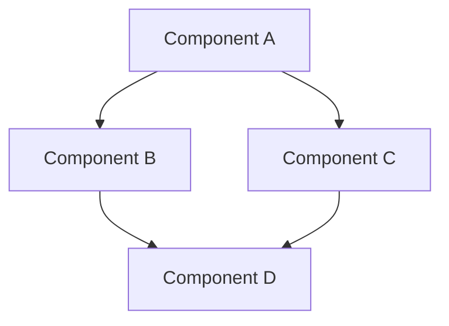

# Specifications Directory

This directory contains all architecture and design documentation for the Custom Monopoly project.

## Purpose

The `/specifications` directory is the single source of truth for:
- System architecture documents
- Architecture Decision Records (ADRs)
- Design patterns and guidelines
- Component specifications
- Integration requirements
- Performance targets and strategies

## Directory Structure

```
specifications/
├── README.md                          # This file
├── architecture/                      # High-level architecture documents
│   ├── system-overview.md            # Overall system architecture
│   ├── component-diagrams.md         # Component interaction diagrams
│   └── technology-stack.md           # Technology choices and rationale
├── decisions/                         # Architecture Decision Records (ADRs)
│   ├── adr-001-example.md
│   ├── adr-002-example.md
│   └── template.md                   # ADR template
├── patterns/                          # Design patterns and guidelines
│   ├── entity-component-system.md
│   ├── event-driven-design.md
│   └── state-management.md
├── windows-integration/               # Windows-specific architecture
│   ├── directx-integration.md
│   ├── input-systems.md
│   └── distribution.md
└── research/                          # Research notes and references
    ├── competitor-analysis.md
    ├── best-practices.md
    └── lessons-learned.md
```

## Document Types

### 1. Architecture Documents
High-level system design documents that describe:
- System boundaries and context
- Major subsystems and their interactions
- Technology stack decisions
- Deployment architecture

**Location**: `specifications/architecture/`

### 2. Architecture Decision Records (ADRs)
Documents that capture important architectural decisions, including:
- Context and problem statement
- Decision made
- Consequences and trade-offs
- Alternatives considered
- References to research

**Location**: `specifications/decisions/`
**Naming**: `adr-XXX-short-title.md` (where XXX is a sequential number)

### 3. Design Patterns
Documents describing specific design patterns used in the project:
- Pattern description and intent
- When to use the pattern
- Implementation guidelines (no actual code)
- Examples from successful games
- Trade-offs and considerations

**Location**: `specifications/patterns/`

### 4. Windows Integration Specs
Platform-specific architectural documentation:
- DirectX integration strategies
- Windows Runtime (WinRT) usage
- Input device support
- Distribution and deployment

**Location**: `specifications/windows-integration/`

### 5. Research Documentation
Notes from research into best practices and competitor analysis:
- Analysis of successful games (Halo, Minecraft, Age of Empires, etc.)
- Industry best practices
- Post-mortem lessons learned
- Anti-patterns to avoid

**Location**: `specifications/research/`

## Writing Guidelines

### For All Documents

1. **Use Markdown Format**: All documents should be in Markdown (.md) for easy version control and readability
2. **Include Metadata**: Start documents with title, date, author, and status
3. **Add Diagrams**: Use Mermaid syntax for diagrams when possible
4. **Reference Sources**: Always cite research sources and references
5. **Keep Updated**: Documents should evolve with the project

### Visual Standards

Use Mermaid for diagrams:



### Document Template

```markdown
# [Document Title]

**Date**: YYYY-MM-DD
**Author**: [Author name or role]
**Status**: [Draft | Review | Approved | Deprecated]
**Related Documents**: [Links to related specs]

## Overview
[Brief description of what this document covers]

## Content
[Main content sections]

## References
[Sources, research links, similar projects]

## Revision History
| Date | Version | Changes | Author |
|------|---------|---------|--------|
| YYYY-MM-DD | 1.0 | Initial version | Name |
```

## Quality Standards

All documents in this directory should meet these standards:

### Clarity
- Written for both technical and non-technical audiences
- Clear section hierarchy
- No unnecessary jargon (or jargon is explained)
- Examples provided where helpful

### Completeness
- All architectural concerns addressed
- Trade-offs documented
- Alternatives considered
- Research cited

### Accuracy
- Based on research and industry best practices
- References verified
- Technical details accurate
- Updated when architecture changes

### Visual Communication
- Diagrams for complex relationships
- Tables for comparisons
- Clear formatting and structure

## How to Use This Directory

### For Architects
1. Review existing documents before creating new ones
2. Follow the established structure and naming conventions
3. Create ADRs for any significant architectural decisions
4. Update related documents when making changes
5. Reference industry research and best practices

### For Developers
1. Read architecture docs before implementing features
2. Follow the patterns and guidelines specified
3. Raise questions about unclear specifications
4. Suggest updates when discovering architectural issues

### For Project Managers
1. Review architecture documents to understand system complexity
2. Use ADRs to understand decision rationale
3. Reference for technical discussions with stakeholders

### For New Team Members
1. Start with `architecture/system-overview.md`
2. Read relevant pattern documents for your area
3. Review recent ADRs to understand current direction
4. Ask questions about unclear aspects

## Contributing

### Adding New Documents
1. Choose the appropriate subdirectory
2. Follow the naming convention for that document type
3. Use the provided templates
4. Include all required sections
5. Add references to research and sources
6. Update this README if adding new categories

### Updating Existing Documents
1. Update the revision history table
2. Mark outdated information clearly
3. Consider creating a new ADR if the change is significant
4. Update related documents that reference the changed doc

### Document Review Process
1. **Draft**: Initial version, work in progress
2. **Review**: Ready for team review
3. **Approved**: Reviewed and accepted by team
4. **Deprecated**: Superseded by newer documents

## Tools and Resources

### Recommended Diagram Tools
- **Mermaid**: For inline diagrams in Markdown
- **PlantUML**: For complex UML diagrams
- **Draw.io**: For custom architectural diagrams

### Architecture Resources
- [C4 Model](https://c4model.com/) - For software architecture diagrams
- [arc42](https://arc42.org/) - Architecture documentation template
- [ADR Tools](https://github.com/npryce/adr-tools) - For managing ADRs

### Game Architecture References
- [Game Programming Patterns](https://gameprogrammingpatterns.com/)
- [Game Engine Architecture](https://www.gameenginebook.com/)
- [Gamasutra Post-Mortems](https://www.gamedeveloper.com/postmortem)

## Notes

⚠️ **This directory should NOT contain code** - It's for architectural documentation only

✅ **This directory SHOULD contain**:
- High-level system designs
- Architectural decisions and rationale
- Design patterns and guidelines
- Research and analysis
- Diagrams and visual representations

## Questions?

If you have questions about:
- **What to document**: Consult with the Software Architect
- **How to document**: Follow the templates and guidelines above
- **Where to document**: Use the directory structure outlined above

---

**Last Updated**: 2026-02-14
**Maintained By**: Software Architect Team
