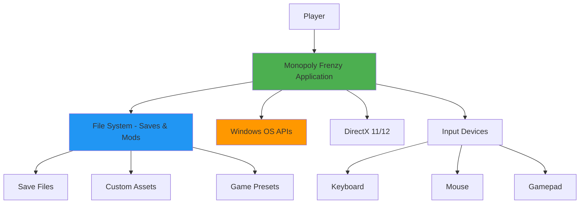
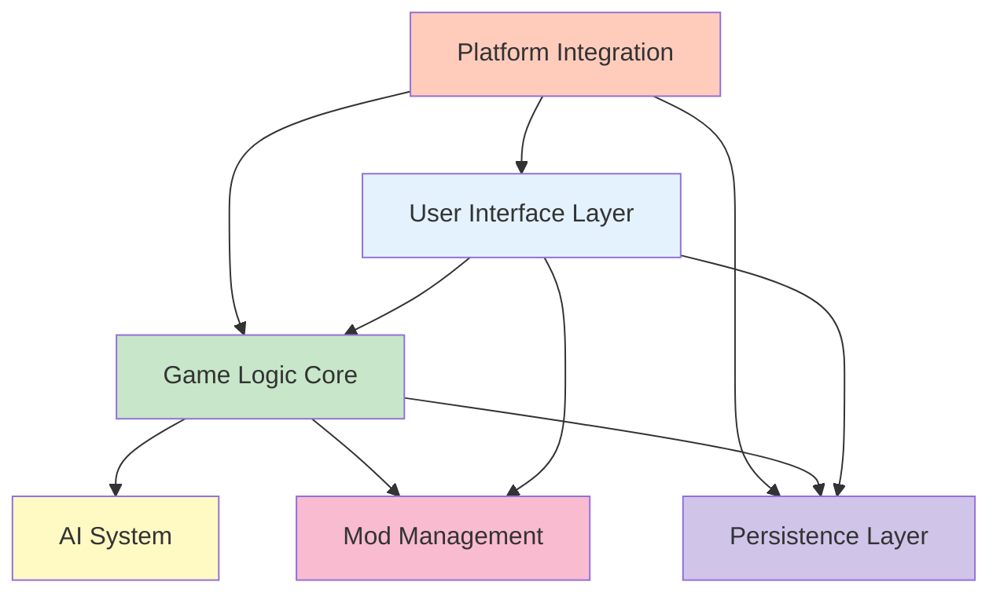
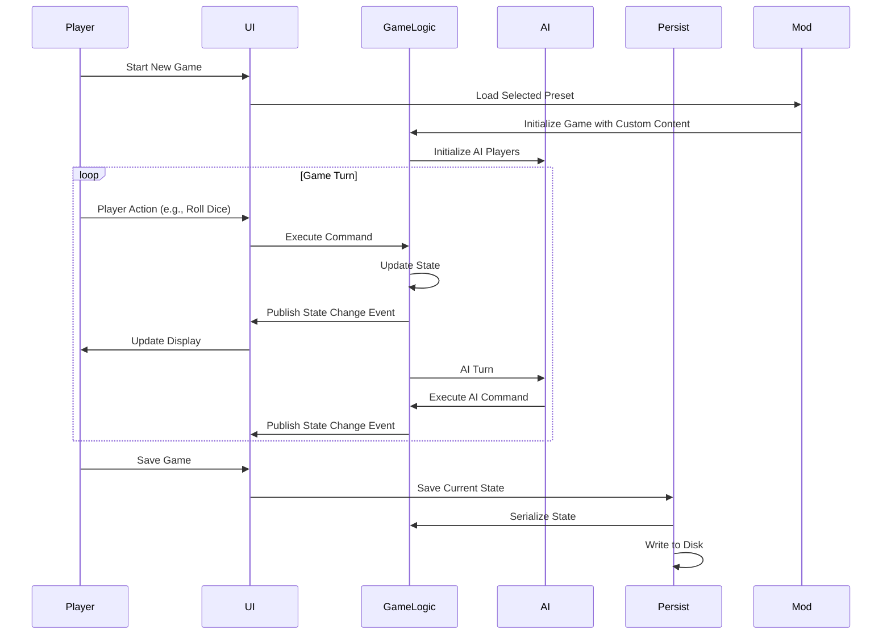
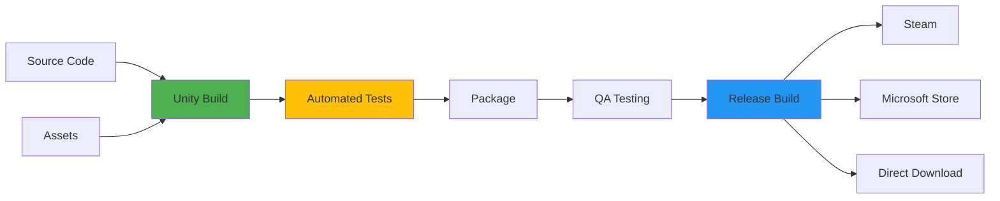

# Monopoly Frenzy - System Architecture Overview

**Date**: 2026-02-16  
**Status**: Approved  
**Author**: Software Architect Agent  
**Related Documents**:
- [Research: Board Game Architectures](../research/board-game-architectures.md)
- [ADR-001: Technology Stack Selection](../decisions/adr-001-technology-stack-selection.md)
- [ADR-002: Game State Management](../decisions/adr-002-game-state-management.md)
- [ADR-003: Mod Support Architecture](../decisions/adr-003-mod-support-architecture.md)

## 1. Introduction

### 1.1 Purpose

This document describes the high-level system architecture for **Monopoly Frenzy**, a customizable Monopoly clone for Windows with enhanced features including AI opponents, mod support, and flexible game rules.

### 1.2 Scope

This architecture covers:
- Overall system structure and subsystem interactions
- Technology stack and framework choices
- Key architectural patterns and design decisions
- Performance and quality requirements
- Deployment and distribution architecture

### 1.3 Audience

This document is intended for:
- Software developers implementing the game
- Technical leads making architectural decisions
- QA engineers planning test strategies
- Project managers estimating effort and complexity

### 1.4 Architectural Goals

The architecture prioritizes:
1. **Modularity**: Clear separation between game logic, UI, and platform-specific code
2. **Extensibility**: Easy to add new features, rule variants, and mod support
3. **Maintainability**: Clean code structure with well-defined interfaces
4. **Performance**: Smooth 60 FPS gameplay on modest Windows hardware
5. **Testability**: Game rules and AI can be tested without UI dependencies

## 2. System Context

### 2.1 High-Level Overview

Monopoly Frenzy is a single-player and local multiplayer board game application for Windows that extends the classic Monopoly gameplay with customization features and AI opponents.



### 2.2 External Dependencies

| Dependency | Purpose | Interface |
|------------|---------|-----------|
| **Windows 10/11 OS** | Platform runtime | Win32 API, WinRT |
| **DirectX 11/12** | Graphics rendering | DirectX API |
| **File System** | Save games and mods | Standard file I/O |
| **Input Devices** | User interaction | XInput, DirectInput |
| **.NET Runtime** | Application framework | .NET 6/7 APIs |
| **Unity Engine** | Game framework | Unity API |

### 2.3 Key Stakeholders

| Stakeholder | Interest | Concerns |
|-------------|----------|----------|
| **Players** | Fun, customizable gameplay | Ease of use, mod support |
| **Developers** | Clean, maintainable code | Architecture clarity, testability |
| **Content Creators** | Easy mod creation | Clear mod format, documentation |
| **Windows Users** | Native Windows experience | Performance, stability |

## 3. Architectural Drivers

### 3.1 Functional Requirements

1. **Core Gameplay**:
   - Traditional Monopoly rules and mechanics
   - 2-6 players (human and/or AI)
   - Three AI difficulty levels (Easy, Medium, Hard)

2. **Customization**:
   - Custom property sets (minimum 3 properties)
   - Custom Chance and Community Chest cards with optional physical actions
   - Custom railroads, utilities, jail, and pass go rules
   - Preset system for saving custom configurations

3. **User Interface**:
   - Main menu with start, continue, load, settings
   - Game setup screen with player and rule customization
   - Settings screen with mod management and preset creation
   - In-game board view with player interactions

4. **Persistence**:
   - Save and load game state
   - Auto-save for continue option
   - Preset storage and management

### 3.2 Quality Attributes

#### Performance
- **Frame Rate**: Maintain 60 FPS during gameplay
- **Load Times**: <2 seconds for screen transitions, <5 seconds for game load
- **Input Latency**: <100ms response to user input
- **Memory**: <500 MB RAM usage during gameplay

#### Maintainability
- **Modularity**: Clear subsystem boundaries with minimal coupling
- **Code Quality**: Follow C# coding standards and best practices
- **Documentation**: Inline code comments and architectural documentation
- **Testing**: 80%+ code coverage for game logic

#### Extensibility
- **Mod Support**: Easy addition of custom content without code changes
- **Rule Variants**: Support for house rules and game variations
- **AI Expansion**: Easy to add new AI algorithms or difficulty levels
- **Future Features**: Architecture supports online multiplayer addition

#### Usability
- **Intuitive UI**: Clear navigation and game controls
- **Accessibility**: Keyboard navigation, high contrast mode
- **Tutorial**: In-game help and rule explanations
- **Error Handling**: Graceful handling of invalid mods or corrupted saves

#### Portability
- **Primary**: Windows 10/11 (64-bit)
- **Future**: Potential for Windows 7/8 with compatibility layer
- **Consideration**: Architecture allows future porting to other platforms

### 3.3 Technical Constraints

| Constraint | Impact | Mitigation |
|------------|--------|------------|
| Windows-only target | Limits market | Use cross-platform framework (Unity) for future flexibility |
| 2D graphics requirement | Simpler than 3D | Leverage Unity's 2D tools, sprite-based rendering |
| Mod security | Malicious mods could crash game | Validate all mod files, sandboxed loading |
| Local multiplayer only | No network code initially | Design with network abstraction for future addition |
| Indie development | Limited resources | Use existing frameworks, avoid custom engine |

## 4. System Decomposition

### 4.1 Major Subsystems

The system is decomposed into 6 major subsystems, each with clear responsibilities and interfaces:



### 4.2 Subsystem Descriptions

#### 4.2.1 User Interface Layer

**Responsibility**: Presentation and user interaction

**Components**:
- **Screen Manager**: Controls screen navigation and transitions
- **Main Menu Screen**: Start, continue, load, settings
- **Game Setup Screen**: Configure players, rules, presets
- **Settings Screen**: Mod management, preset creation
- **Game Board View**: Main gameplay interface
- **HUD Elements**: Player stats, turn indicator, action buttons
- **Animation Controller**: Manages visual feedback and transitions

**Key Design Patterns**:
- State pattern for screen management
- Observer pattern for game state updates
- Command pattern for user actions

**Technology**: Unity UI (Canvas, UI Toolkit)

#### 4.2.2 Game Logic Core

**Responsibility**: Game rules, state management, turn execution

**Components**:
- **Game State Manager**: Maintains current game state
- **Rule Engine**: Enforces Monopoly rules and variants
- **Turn Manager**: Controls turn sequence and player actions
- **Property Manager**: Handles property ownership and rent
- **Card Manager**: Manages Chance and Community Chest cards
- **Transaction Manager**: Handles money transfers and trades
- **Event System**: Publishes game events for observers

**Key Design Patterns**:
- State machine for game flow
- Command pattern for player actions (enables undo/redo)
- Strategy pattern for rule variants
- Observer pattern for event notifications

**Technology**: Pure C# classes, no Unity dependencies

#### 4.2.3 AI System

**Responsibility**: Computer opponent decision-making

**Components**:
- **AI Controller**: Manages AI player instances
- **Decision Engine**: Core AI logic for each difficulty
  - **Easy AI**: Rule-based heuristics
  - **Medium AI**: Minimax with limited lookahead
  - **Hard AI**: Monte Carlo Tree Search
- **Evaluation Function**: Scores game positions
- **Strategy Interface**: Common interface for all AI levels

**Key Design Patterns**:
- Strategy pattern for different AI difficulties
- Template method for AI decision flow

**Technology**: Pure C# with optional parallel processing for MCTS

#### 4.2.4 Mod Management

**Responsibility**: Loading and validating custom content

**Components**:
- **Mod Loader**: Discovers and loads mod files
- **Asset Validator**: Validates mod file formats and content
- **Property Set Manager**: Loads custom property definitions
- **Card Set Manager**: Loads custom card sets
- **Preset Manager**: Manages saved game configurations
- **Resource Provider**: Provides assets to game logic and UI

**Key Design Patterns**:
- Factory pattern for creating game elements from mods
- Builder pattern for constructing game configurations
- Facade pattern for simplified mod API

**Technology**: Unity AssetBundles or Resources system, JSON for data

#### 4.2.5 Persistence Layer

**Responsibility**: Save/load game state and settings

**Components**:
- **Save Manager**: Handles save game operations
- **Load Manager**: Restores game state from disk
- **Settings Manager**: Persists application settings
- **Serialization Service**: Converts game state to/from storage format
- **File Manager**: Platform-specific file operations

**Key Design Patterns**:
- Memento pattern for save state capture
- Repository pattern for storage abstraction
- Singleton pattern for save manager

**Technology**: JSON serialization, Windows file system

#### 4.2.6 Platform Integration

**Responsibility**: Windows-specific functionality

**Components**:
- **Input Manager**: Keyboard, mouse, gamepad handling
- **Graphics Manager**: DirectX initialization and rendering
- **Audio Manager**: Sound and music playback
- **Window Manager**: Application window control
- **Performance Monitor**: Frame rate and resource tracking

**Key Design Patterns**:
- Adapter pattern for platform abstractions
- Facade pattern for Unity/Windows API

**Technology**: Unity Input System, DirectX via Unity

### 4.3 Component Interaction Diagram



### 4.4 Data Flow Architecture

```mermaid
graph LR
    subgraph "Input"
        Files[Mod Files]
        Save[Save Files]
        Input[User Input]
    end
    
    subgraph "Processing"
        Mod[Mod Manager]
        Load[Load Manager]
        Game[Game Logic]
        AI[AI Engine]
    end
    
    subgraph "Output"
        UI[User Interface]
        Audio[Audio System]
        SaveOut[Save System]
    end
    
    Files --> Mod
    Save --> Load
    Input --> Game
    
    Mod --> Game
    Load --> Game
    Game --> AI
    AI --> Game
    
    Game --> UI
    Game --> Audio
    Game --> SaveOut
    
    style Processing fill:#C8E6C9
```

## 5. Technology Stack

### 5.1 Core Technologies

| Technology | Version | Purpose | Rationale |
|------------|---------|---------|-----------|
| **C#** | 10.0+ | Primary language | Strong Windows integration, modern features, Unity compatibility |
| **.NET** | 6.0/7.0 | Runtime framework | Current LTS, performance, Windows integration |
| **Unity** | 2022 LTS | Game engine | Excellent 2D tools, asset management, proven for board games |
| **DirectX** | 11/12 | Graphics API | Windows standard, broad hardware support |

### 5.2 Why Unity and C#?

Based on extensive research (see [Board Game Architectures Research](../research/board-game-architectures.md)), Unity with C# is recommended for the following reasons:

**Unity Benefits**:
1. **Proven Track Record**: Used by Tabletop Simulator, Catan Universe, Armello
2. **2D Excellence**: Sprite system, animation tools, UI framework perfect for board games
3. **Asset Pipeline**: Built-in support for mod-friendly asset loading
4. **Development Speed**: Visual editor, prefabs, scene management accelerate development
5. **Cross-Platform Future**: Easy port to other platforms if needed
6. **Community Resources**: Extensive tutorials, assets, and support for board games

**C# Benefits**:
1. **Windows Integration**: First-class support for Windows APIs
2. **Modern Language**: Async/await, LINQ, pattern matching, nullable references
3. **Strong Typing**: Catch errors at compile time
4. **Garbage Collection**: Simplifies memory management
5. **Excellent Tooling**: Visual Studio debugger, profiler, analyzers
6. **Performance**: Good balance of performance and productivity

**Alternatives Considered**:
- **C++ with Custom Engine**: More control but much longer development time
- **MonoGame**: More lightweight but requires building more infrastructure
- **Godot**: Excellent engine but less Windows-specific optimization
- **WPF/WinForms**: Too limited for game graphics and animations

See [ADR-001: Technology Stack Selection](../decisions/adr-001-technology-stack-selection.md) for detailed rationale.

### 5.3 Third-Party Libraries

| Library | Purpose | Rationale |
|---------|---------|-----------|
| **Newtonsoft.Json** | JSON serialization | Industry standard, flexible, well-tested |
| **NUnit** | Unit testing | Unity-compatible, comprehensive testing features |
| **DOTween** | Animation tweening | Smooth animations, Unity integration |
| **Unity Input System** | Input handling | Modern, flexible input management |

## 6. Design Patterns and Principles

### 6.1 Architectural Patterns

#### Model-View-Controller (MVC)
**Application**: Overall application structure

- **Model**: Game Logic Core (game state, rules)
- **View**: User Interface Layer (rendering, animations)
- **Controller**: Input handlers and command processors

**Benefits**:
- Clear separation of concerns
- Game logic testable without UI
- Multiple views possible (2D/3D, different styles)

#### Event-Driven Architecture
**Application**: Communication between subsystems

**Implementation**:
- Game Logic publishes events (e.g., PlayerMoved, PropertyPurchased)
- UI, Audio, and other systems subscribe to relevant events
- Loose coupling between publishers and subscribers

**Benefits**:
- Easy to add new observers (achievements, analytics, etc.)
- Decoupled subsystems
- Natural fit for game state changes

### 6.2 Design Patterns

#### State Pattern
**Usage**: Game flow and screen management

**Implementation**:
```
States: MainMenu -> GameSetup -> Playing -> GameOver
Turn States: RollDice -> MovePiece -> TakeTurnAction -> EndTurn
```

**Benefits**:
- Clear state transitions
- Easy to add new states
- Prevents invalid state combinations

#### Command Pattern
**Usage**: All player and AI actions

**Implementation**:
- Each action is a command object (RollDiceCommand, BuyPropertyCommand, etc.)
- Commands encapsulate all action data
- Command history enables undo/redo
- Commands can be serialized for network play (future)

**Benefits**:
- Undo/redo support
- Replay functionality
- Testable actions
- Network-ready architecture

#### Observer Pattern
**Usage**: UI updates, event notifications

**Implementation**:
- Game events published through event bus
- UI components subscribe to relevant events
- Audio system listens for sound trigger events

**Benefits**:
- Loose coupling
- Easy to add new listeners
- Natural fit for reactive UI

#### Strategy Pattern
**Usage**: AI difficulty levels, rule variants

**Implementation**:
- Common AI interface: `IPlayerStrategy`
- Different implementations: `EasyAI`, `MediumAI`, `HardAI`
- Swappable at runtime

**Benefits**:
- Easy to add new AI types
- Testable in isolation
- Clean abstraction

#### Factory Pattern
**Usage**: Creating game elements from mods

**Implementation**:
- `PropertyFactory` creates properties from mod data
- `CardFactory` creates cards from mod data
- Validates and constructs proper objects

**Benefits**:
- Centralized creation logic
- Easy to extend with new types
- Validation in one place

### 6.3 SOLID Principles

The architecture follows SOLID principles:

1. **Single Responsibility**: Each class has one clear purpose
2. **Open/Closed**: Extensible through interfaces and inheritance
3. **Liskov Substitution**: All AI implementations interchangeable
4. **Interface Segregation**: Small, focused interfaces
5. **Dependency Inversion**: Depend on abstractions, not concrete classes

### 6.4 Anti-Patterns to Avoid

| Anti-Pattern | Description | Prevention |
|--------------|-------------|------------|
| **God Object** | Single class doing too much | Clear single responsibility per class |
| **Tight Coupling** | Direct dependencies between components | Use interfaces and events |
| **Premature Optimization** | Optimizing before profiling | Profile first, optimize based on data |
| **Hardcoded Values** | Magic numbers and strings in code | Configuration files and constants |
| **Blocking Operations** | Synchronous operations blocking gameplay | Async/await for I/O, animation queues |

## 7. Performance Strategy

### 7.1 Performance Targets

| Metric | Target | Measurement |
|--------|--------|-------------|
| **Frame Rate** | 60 FPS stable | Unity Profiler |
| **Input Latency** | <100ms | Input to visual response time |
| **Load Time** | <2s screen transitions | Stopwatch timing |
| **Game Load** | <5s from disk | Full game state restoration |
| **Memory Usage** | <500 MB | Task Manager / Unity Profiler |
| **Startup Time** | <3s | Application launch to main menu |

### 7.2 Optimization Strategies

#### 7.2.1 Rendering Optimization
- **Sprite Atlasing**: Combine sprites to reduce draw calls
- **Object Pooling**: Reuse game objects instead of create/destroy
- **Dirty Rectangles**: Only redraw changed UI elements
- **LOD**: Use simpler graphics when zoomed out (if 3D elements added)
- **Batching**: Batch similar render calls together

#### 7.2.2 Logic Optimization
- **Separate Update Rates**: Game logic at 30 Hz, rendering at 60 Hz
- **Caching**: Cache computed values (paths, valid moves)
- **Efficient Data Structures**: Use appropriate collections (HashSet for fast lookup)
- **Minimize Allocations**: Avoid allocations in hot paths (update loops)
- **Parallel Processing**: Use async for AI calculations (MCTS)

#### 7.2.3 Asset Optimization
- **Texture Compression**: Use compressed formats (DXT)
- **Async Loading**: Load assets asynchronously to prevent frame drops
- **Asset Unloading**: Unload unused assets between screens
- **Streaming**: Stream large assets instead of loading all at once

#### 7.2.4 Memory Management
- **Object Pooling**: Pool frequently created/destroyed objects
- **Resource Budgets**: Set limits per subsystem
- **Garbage Collection**: Minimize allocations to reduce GC pressure
- **Asset References**: Properly release asset references

### 7.3 Profiling and Monitoring

**Tools**:
- Unity Profiler for CPU, GPU, memory analysis
- Deep Profile for detailed call stacks
- Memory Profiler for memory leaks
- Frame Debugger for rendering analysis

**Process**:
1. Profile regularly during development
2. Focus optimization on measured bottlenecks
3. Set performance budgets for each system
4. Automated performance tests in CI

## 8. Deployment Architecture

### 8.1 Build Pipeline



### 8.2 Distribution Options

#### Option 1: Steam (Recommended)
**Pros**:
- Largest PC gaming audience
- Built-in update system
- Community features
- Workshop for mods
- Analytics and telemetry

**Cons**:
- 30% revenue share
- Steam approval process
- Requires Steamworks SDK integration

#### Option 2: Microsoft Store
**Pros**:
- Native Windows integration
- Windows 10/11 visibility
- Microsoft certification
- Automatic updates

**Cons**:
- Smaller gaming audience
- UWP packaging complexity
- Microsoft approval required

#### Option 3: Itch.io
**Pros**:
- Indie-friendly
- Flexible revenue sharing
- Easy updates
- No approval process

**Cons**:
- Smaller audience
- Less discovery
- Manual update notification

#### Option 4: Direct Download
**Pros**:
- Full control
- No platform fees
- Direct customer relationship

**Cons**:
- Manual update system required
- No built-in distribution
- Need own payment processing

**Recommendation**: Start with Steam for widest reach, add Microsoft Store later

### 8.3 Update Strategy

**Approach**: Staged rollout with update notifications

**Implementation**:
1. **Version Checking**: Check for updates on startup
2. **Automatic Download**: Download updates in background
3. **User Notification**: Prompt user to restart for update
4. **Rollback Support**: Keep previous version for rollback if needed

**Save Compatibility**:
- Save file version number
- Migration system for save files
- Fallback to defaults for missing data

### 8.4 Installation Structure

```
MonopolyFrenzy/
├── MonopolyFrenzy.exe          # Main executable
├── MonopolyFrenzy_Data/         # Unity data files
│   ├── Managed/                 # .NET assemblies
│   ├── Resources/               # Built-in resources
│   └── StreamingAssets/         # Custom assets
├── Mods/                        # User mod directory
│   ├── Properties/              # Custom property sets
│   ├── Cards/                   # Custom card sets
│   └── Presets/                 # Saved presets
├── Saves/                       # Save game directory
│   └── autosave.json           # Auto-save file
└── Config/                      # Configuration files
    └── settings.json            # User settings
```

## 9. Security and Validation

### 9.1 Mod Security

**Threats**:
- Malicious file paths (directory traversal)
- Oversized files (memory exhaustion)
- Malformed JSON (parsing errors)
- Invalid image formats (crashes)

**Mitigations**:
- **Path Validation**: Restrict to mod directory only
- **File Size Limits**: Maximum file sizes for assets
- **Format Validation**: Strict JSON schema validation
- **Image Validation**: Check image headers and dimensions
- **Sandboxed Loading**: Catch and handle all mod loading errors
- **Fallback System**: Use defaults if mod fails to load

### 9.2 Save File Validation

**Protections**:
- Version checking and migration
- JSON schema validation
- Checksum verification for integrity
- Backup before overwriting saves
- Graceful degradation if corrupt

### 9.3 Input Validation

**Protections**:
- Validate all user inputs
- Range checks on numeric inputs
- Sanitize file paths
- Timeout on AI calculations
- Prevent infinite loops

## 10. Testing Strategy

### 10.1 Unit Testing

**Scope**: Game Logic Core, AI System

**Framework**: NUnit

**Coverage Target**: 80%+ for game rules and AI

**Example Tests**:
- Property purchase validation
- Rent calculation correctness
- Turn sequence enforcement
- AI decision making
- Card effect application

### 10.2 Integration Testing

**Scope**: Subsystem interactions

**Tests**:
- UI to Game Logic communication
- Save/Load full cycle
- Mod loading and application
- Game state persistence
- Event propagation

### 10.3 Performance Testing

**Scope**: Frame rate, load times, memory

**Tests**:
- Sustained 60 FPS during gameplay
- Load time benchmarks
- Memory usage profiling
- AI calculation performance

### 10.4 Playtesting

**Scope**: User experience and game balance

**Methods**:
- AI vs AI automated games (thousands of games)
- Human playtesting sessions
- Telemetry data collection
- Bug reporting tools

### 10.5 Mod Testing

**Scope**: Mod loading and validation

**Tests**:
- Valid mod loading
- Invalid mod rejection
- Malformed file handling
- Resource conflicts
- Preset loading

## 11. Future Considerations

### 11.1 Planned Enhancements

1. **Online Multiplayer**:
   - Architecture supports networked commands
   - Add client-server or relay server
   - Matchmaking and lobby system

2. **Advanced 3D Board**:
   - Current architecture separates presentation from logic
   - Can add 3D view alongside 2D
   - Animated 3D pieces and board

3. **Mobile Ports**:
   - Unity enables iOS/Android builds
   - Touch-optimized UI layer
   - Cloud save synchronization

4. **Expanded AI**:
   - Machine learning AI
   - Personality-based AI
   - Adaptive difficulty

5. **Social Features**:
   - Leaderboards
   - Achievements
   - Mod sharing platform

### 11.2 Scalability Plans

**Performance Scaling**:
- Current architecture handles 6 players easily
- Can scale to 8-10 players with minimal changes
- AI parallelization for faster calculations

**Content Scaling**:
- Mod system supports unlimited custom content
- Preset system supports any number of configurations
- Asset streaming for large mod collections

### 11.3 Technical Debt Management

**Strategy**:
1. **Code Reviews**: Regular peer review process
2. **Refactoring Sprints**: Dedicated time for cleanup
3. **Documentation**: Keep architecture docs updated
4. **Dependency Updates**: Regular updates to libraries
5. **Performance Monitoring**: Continuous profiling

**Debt Prevention**:
- Follow SOLID principles
- Write tests before features
- Document design decisions (ADRs)
- Regular architecture reviews

## 12. Development Roadmap

### Phase 1: Foundation (Weeks 1-4)
- Set up Unity project structure
- Implement core game logic (no UI)
- Basic state machine
- Unit tests for rules

### Phase 2: UI and Core Features (Weeks 5-8)
- Main menu and navigation
- Game board UI
- Basic gameplay loop
- Local multiplayer

### Phase 3: AI System (Weeks 9-11)
- Easy AI (rule-based)
- Medium AI (minimax)
- Hard AI (MCTS)
- AI testing and tuning

### Phase 4: Mod Support (Weeks 12-14)
- Mod loading system
- Validation and error handling
- Preset management
- Documentation for modders

### Phase 5: Polish and Testing (Weeks 15-16)
- Performance optimization
- Bug fixes
- Playtesting
- Balance tuning

### Phase 6: Deployment (Week 17-18)
- Build pipeline
- Steam integration
- Final QA
- Release

## 13. Risks and Mitigations

| Risk | Impact | Likelihood | Mitigation |
|------|--------|------------|------------|
| **Unity version compatibility issues** | High | Low | Use LTS version, test updates thoroughly |
| **Mod system exploits** | Medium | Medium | Robust validation, sandboxed loading |
| **Performance on low-end hardware** | High | Medium | Early profiling, performance budgets |
| **Save file corruption** | High | Low | Versioning, backups, validation |
| **AI taking too long** | Medium | Medium | Time limits, progressive difficulty |
| **Scope creep** | High | High | Clear feature prioritization, phased approach |
| **Third-party library issues** | Medium | Low | Use stable, well-maintained libraries |

## 14. References

### Internal Documents
- [Board Game Architectures Research](../research/board-game-architectures.md)
- [ADR-001: Technology Stack Selection](../decisions/adr-001-technology-stack-selection.md)
- [ADR-002: Game State Management](../decisions/adr-002-game-state-management.md)
- [ADR-003: Mod Support Architecture](../decisions/adr-003-mod-support-architecture.md)

### External Resources

**Game Architecture**:
- "Game Programming Patterns" by Robert Nystrom
- "Game Engine Architecture" by Jason Gregory
- Unity Learn: Board Game Tutorials

**Similar Games**:
- Tabletop Simulator: Mod system reference
- Ticket to Ride: Cross-platform architecture
- Catan Universe: Event-driven design
- Monopoly Plus: Animation and presentation

**Windows Development**:
- Microsoft Docs: DirectX Integration
- Unity Manual: Windows Standalone Player
- Steam Documentation: Steamworks SDK

## 15. Glossary

| Term | Definition |
|------|------------|
| **ADR** | Architecture Decision Record - documents key architectural decisions |
| **Command Pattern** | Design pattern where actions are encapsulated as objects |
| **ECS** | Entity Component System - architecture pattern for flexible game objects |
| **Hot-Seat Multiplayer** | Local multiplayer where players take turns on same device |
| **MCTS** | Monte Carlo Tree Search - AI algorithm using random simulation |
| **Mod** | User-created modification or custom content |
| **Preset** | Saved configuration of game rules and custom content |
| **State Machine** | Pattern for managing discrete states and transitions |
| **Unity LTS** | Long-Term Support version of Unity engine |

---

## Revision History

| Date | Version | Changes | Author |
|------|---------|---------|--------|
| 2026-02-16 | 1.0 | Initial architecture document | Software Architect Agent |

