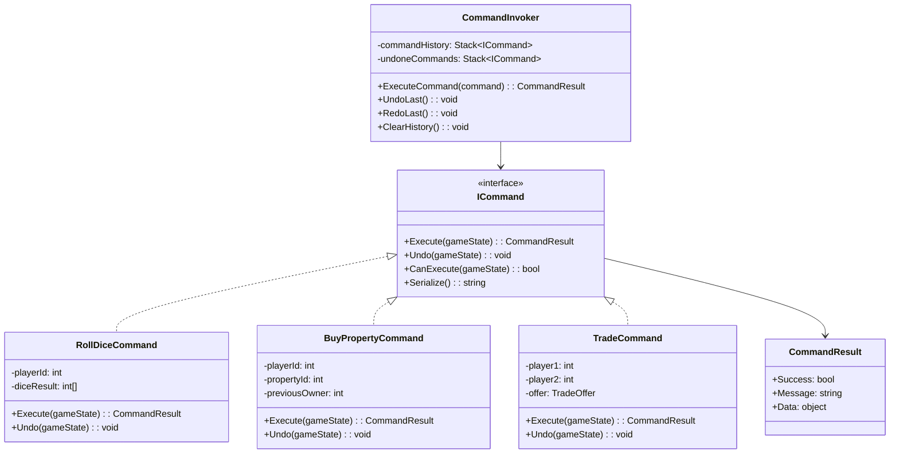
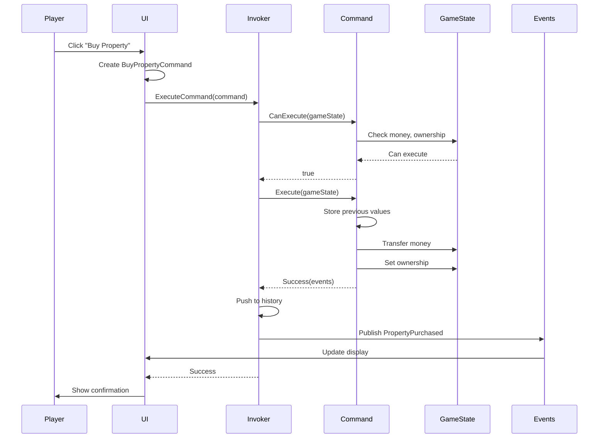

# Command Pattern for Monopoly Frenzy

**Date**: 2026-02-16  
**Status**: Approved  
**Related Documents**:
- [ADR-002: Game State Management](../decisions/adr-002-game-state-management.md)
- [System Overview](../architecture/monopoly-frenzy-system-overview.md)

## Overview

The Command Pattern is used in Monopoly Frenzy to encapsulate all player and AI actions as objects. This enables undo/redo, replay, network play (future), and testable game logic.

## Pattern Description

### Intent

Encapsulate a request as an object, thereby letting you parameterize clients with different requests, queue or log requests, and support undoable operations.

### Problem It Solves

In games, player actions (buy property, pay rent, trade) need to be:
- Validated before execution
- Undoable (for player mistakes)
- Loggable (for debugging and telemetry)
- Serializable (for network play and saves)
- Testable (without UI dependencies)

Without the Command pattern, this logic is scattered throughout UI event handlers and game code, making it hard to maintain and extend.

### Solution

Encapsulate each action as a command object with `Execute()` and `Undo()` methods. Commands contain all data needed for the action.

## Architecture Diagram



## Monopoly Frenzy Commands

### Core Game Commands

1. **RollDiceCommand**
   - **Purpose**: Roll dice for movement
   - **Parameters**: Player ID, (optional) force result for testing
   - **Execute**: Roll dice, store result, advance player state
   - **Undo**: Restore previous dice result and player state
   - **Validation**: Player's turn, in RollDice state, not bankrupt

2. **MovePlayerCommand**
   - **Purpose**: Move player piece to new position
   - **Parameters**: Player ID, destination space, passing Go
   - **Execute**: Move piece, collect Go money if passed, trigger space events
   - **Undo**: Return to previous position, remove Go money
   - **Validation**: Valid destination, player's turn

3. **BuyPropertyCommand**
   - **Purpose**: Purchase unowned property
   - **Parameters**: Player ID, property ID, price
   - **Execute**: Transfer money, assign ownership, give deed
   - **Undo**: Return money, remove ownership
   - **Validation**: Property unowned, player has money, player on space

4. **PayRentCommand**
   - **Purpose**: Pay rent to property owner
   - **Parameters**: Player ID, property ID, amount
   - **Execute**: Transfer money from player to owner
   - **Undo**: Reverse money transfer
   - **Validation**: Property owned, player has money, correct rent amount

5. **DrawCardCommand**
   - **Purpose**: Draw Chance or Community Chest card
   - **Parameters**: Player ID, deck type, (optional) card ID for testing
   - **Execute**: Draw card, apply effect, trigger physical action if custom card
   - **Undo**: Reverse card effect, return card to deck
   - **Validation**: Player on correct space, deck has cards

6. **BuildHouseCommand**
   - **Purpose**: Build house/hotel on property
   - **Parameters**: Player ID, property ID, building type
   - **Execute**: Pay cost, add building, update rent
   - **Undo**: Return money, remove building
   - **Validation**: Owns monopoly, even building rule, has money

7. **MortgagePropertyCommand**
   - **Purpose**: Mortgage property for money
   - **Parameters**: Player ID, property ID
   - **Execute**: Receive money, mark property mortgaged
   - **Undo**: Pay money back, unmortgage property
   - **Validation**: Owns property, property not mortgaged, no buildings

8. **UnmortgagePropertyCommand**
   - **Purpose**: Pay off mortgage on property
   - **Parameters**: Player ID, property ID
   - **Execute**: Pay money with interest, unmortgage property
   - **Undo**: Return money, re-mortgage property
   - **Validation**: Property mortgaged, player has money

9. **TradeCommand**
   - **Purpose**: Execute trade between two players
   - **Parameters**: Player 1 ID, Player 2 ID, trade offer (properties, money, cards)
   - **Execute**: Exchange properties and money
   - **Undo**: Reverse all transfers
   - **Validation**: Both players consent, valid offer, both have resources

10. **GoToJailCommand**
    - **Purpose**: Send player to jail
    - **Parameters**: Player ID
    - **Execute**: Move to jail, set in-jail flag, skip turn actions
    - **Undo**: Return to previous position, clear jail flag
    - **Validation**: Player not already in jail

11. **GetOutOfJailCommand**
    - **Purpose**: Leave jail (pay, card, or roll doubles)
    - **Parameters**: Player ID, method (pay/card/doubles)
    - **Execute**: Execute chosen method, free player
    - **Undo**: Reverse method, return to jail
    - **Validation**: Player in jail, has required resources

12. **DeclareB bankruptcyCommand**
    - **Purpose**: Player declares bankruptcy
    - **Parameters**: Player ID, creditor ID
    - **Execute**: Transfer all assets, remove player from game
    - **Undo**: Restore player and assets
    - **Validation**: Player cannot pay debts

13. **EndTurnCommand**
    - **Purpose**: Complete player's turn
    - **Parameters**: Player ID
    - **Execute**: Clean up turn state, advance to next player
    - **Undo**: Return to previous player
    - **Validation**: All turn actions completed

### AI-Specific Commands

14. **AIDecisionCommand**
    - **Purpose**: Wrapper for AI's chosen action
    - **Parameters**: AI player ID, underlying command
    - **Execute**: Execute wrapped command, log AI decision
    - **Undo**: Undo wrapped command
    - **Validation**: AI's turn, valid underlying command

## When to Use Command Pattern

### ✅ Use Command Pattern When:

1. **Undo/Redo Required**: Players need to undo mistakes
2. **Action Logging Needed**: Track all actions for debugging/analytics
3. **Network Play**: Need to send actions over network
4. **Macro/Scripting**: Support for action sequences
5. **AI Evaluation**: AI needs to try hypothetical actions
6. **Testing**: Need to test game logic without UI

### ❌ Don't Use Command Pattern When:

1. **Simple Queries**: Read-only operations don't need commands
2. **Immediate Feedback**: Real-time actions with no state change
3. **Trivial Operations**: One-line operations with no side effects
4. **No Undo Needed**: If undo is impossible or unnecessary

## Benefits in Monopoly Frenzy

1. **Undo/Redo Support**:
   - Players can undo accidental actions
   - Competitive advantage over other Monopoly games
   - Commands store previous state for reversal

2. **Testability**:
   - Test game logic without UI
   - Create commands programmatically
   - Verify game state changes
   - Mock command execution

3. **Network-Ready**:
   - Serialize commands to JSON
   - Send over network
   - Replay on remote client
   - Deterministic execution

4. **AI Integration**:
   - AI creates and evaluates commands
   - Try hypothetical actions on cloned state
   - Choose best command to execute

5. **Debugging**:
   - Log command history
   - Replay game from command sequence
   - Identify when bugs occur
   - Reproduce issues reliably

6. **Modularity**:
   - Each action is self-contained
   - Easy to add new actions
   - Clear interface for all actions

## Implementation Guidelines

### Command Interface

```
ICommand Interface:
- Execute(gameState): CommandResult
  * Perform the action
  * Return success/failure and any data
  
- Undo(gameState): void
  * Reverse the action
  * Restore previous state
  
- CanExecute(gameState): bool
  * Validate if command can execute
  * Check preconditions
  * Don't modify state
  
- Serialize(): string
  * Convert to JSON or binary
  * Include all parameters
  * For network/save support
  
- Deserialize(string): ICommand
  * Static method to reconstruct command
  * Parse parameters
  * Create command instance
```

### CommandResult Structure

```
CommandResult:
- Success: bool
  * True if command executed successfully
  * False if validation failed or error occurred
  
- Message: string
  * Human-readable result message
  * Error description if failed
  
- Data: object (optional)
  * Additional data from command
  * E.g., dice roll result, card drawn
  
- Events: List<GameEvent>
  * Events to publish after command
  * E.g., PropertyPurchased, MoneyTransferred
```

### Command Invoker

```
CommandInvoker:
- commandHistory: Stack<ICommand>
  * Recently executed commands
  * For undo support
  
- undoneCommands: Stack<ICommand>
  * Recently undone commands
  * For redo support
  
- ExecuteCommand(command):
  1. Validate with CanExecute
  2. Call Execute and get result
  3. If successful, push to history
  4. Clear undone commands
  5. Return result
  
- UndoLast():
  1. Pop from history
  2. Call Undo
  3. Push to undone stack
  
- RedoLast():
  1. Pop from undone
  2. Call Execute
  3. Push to history
```

## Best Practices

### 1. Store All Necessary Data in Command

Commands should be self-contained:

```
✅ Good: Command stores previous owner before buying
BuyPropertyCommand:
- propertyId: 5
- playerId: 2
- price: 200
- previousOwner: -1 (unowned)
- previousPlayerMoney: 1500

❌ Bad: Command queries state in Undo
Undo():
- Query who owned property before (doesn't know!)
```

### 2. Make Commands Serializable

All command data should serialize to JSON:

```
✅ Good: Simple data types
RollDiceCommand:
- playerId: int
- forcedResult: int[] (optional)
- previousState: TurnState enum

❌ Bad: Complex references
RollDiceCommand:
- player: Player object reference (can't serialize)
- gameManager: GameManager reference
```

### 3. Validate in CanExecute, Not Execute

Separate validation from execution:

```
✅ Good:
CanExecute(gameState):
- Check player has money
- Check property is unowned
- Return true/false

Execute(gameState):
- Assume validation passed
- Perform action
- Return success result

❌ Bad:
Execute(gameState):
- Check if valid (duplicate logic)
- Maybe execute
- Maybe fail partway through
```

### 4. Make Undo Symmetrical to Execute

Undo should perfectly reverse Execute:

```
✅ Good:
Execute():
- player.money -= 200
- property.owner = player
- player.properties.add(property)

Undo():
- player.money += 200
- property.owner = null
- player.properties.remove(property)

❌ Bad:
Execute(): Transfers money
Undo(): Doesn't restore money
```

### 5. Use Command for All State Changes

Every state modification should be a command:

```
✅ Good:
player.clickBuyButton():
- Create BuyPropertyCommand
- Send to CommandInvoker
- Let command handle state change

❌ Bad:
player.clickBuyButton():
- player.money -= property.price
- property.owner = player
- (direct state modification, no undo, no logging)
```

### 6. Publish Events After Execution

Commands should trigger events:

```
Execute(gameState):
1. Perform action
2. Collect events that occurred
3. Return events in CommandResult
4. Invoker publishes events after success
```

### 7. Keep Commands Focused

One command, one action:

```
✅ Good:
- BuyPropertyCommand
- PayRentCommand
- DrawCardCommand

❌ Bad:
- DoEverythingCommand
- PlayerActionCommand with type enum
```

### 8. Handle Failures Gracefully

Commands can fail without crashing:

```
Execute(gameState):
if (!HasEnoughMoney()):
  return CommandResult.Failure("Insufficient funds")

if (!PropertyAvailable()):
  return CommandResult.Failure("Property not for sale")

// Execute action
return CommandResult.Success("Property purchased")
```

## Common Pitfalls to Avoid

### ❌ Not Storing Enough State for Undo

**Problem**: Can't undo because don't know previous state

**Solution**: Store all changed values before modifying:

```
Execute():
- previousMoney = player.money  // Store before changing
- player.money -= cost
- previousOwner = property.owner
- property.owner = player

Undo():
- player.money = previousMoney  // Restore stored values
- property.owner = previousOwner
```

### ❌ Side Effects in CanExecute

**Problem**: CanExecute modifies state

**Solution**: CanExecute should be pure (read-only):

```
✅ Good:
CanExecute():
- return player.money >= property.price

❌ Bad:
CanExecute():
- if (player.money >= property.price):
    player.money -= property.price  // Modifies state!
    return true
```

### ❌ Executing Commands Directly

**Problem**: Bypassing command invoker

**Solution**: Always execute through invoker:

```
✅ Good:
commandInvoker.ExecuteCommand(new BuyPropertyCommand(...))

❌ Bad:
new BuyPropertyCommand(...).Execute(gameState)
```

### ❌ Forgetting to Clear Redo Stack

**Problem**: Can redo after new command executed

**Solution**: Clear redo stack on new command:

```
ExecuteCommand(command):
- Execute command
- Push to history
- undoneCommands.Clear()  // Can't redo after new action
```

### ❌ Commands with External Dependencies

**Problem**: Command relies on external services

**Solution**: Pass dependencies or only reference game state:

```
✅ Good:
Execute(gameState):
- Use data from gameState
- Modify gameState
- Return result

❌ Bad:
Execute(gameState):
- Call NetworkManager.Send()  // External dependency
- Access DatabaseService  // Hard to test
```

### ❌ Non-Deterministic Commands

**Problem**: Same command gives different results

**Solution**: Control randomness explicitly:

```
✅ Good:
RollDiceCommand:
- If forcedResult provided, use it
- Else, generate random and store result
- Result always same for same command instance

❌ Bad:
RollDiceCommand:
- Execute(): Roll random dice
- Undo(): ??? (Can't get same roll)
```

## Integration with Other Patterns

### Command + State Machine

State machine validates and executes commands:

```
RollDiceState.HandleInput(rollCommand):
1. Validate we're in correct state
2. Execute command through invoker
3. On success, transition to next state
```

### Command + Observer

Commands publish events after execution:

```
Execute():
1. Perform action
2. Create event (e.g., PropertyPurchased)
3. Return event in result
4. Invoker publishes event
5. Observers react (UI updates, sound plays)
```

### Command + Memento

Alternative to storing previous state in command:

```
Execute():
1. Create memento of current state
2. Store memento in command
3. Perform action

Undo():
1. Restore from memento
```

### Command + Strategy

Commands can use different strategies:

```
PayRentCommand:
- useStrategy: CalculateRentStrategy
- Different strategies for different property types
- Command executes chosen strategy
```

## Example: Buy Property Flow



## Testing Commands

### Unit Testing Individual Commands

```
Test: BuyProperty_SuccessfulPurchase
Arrange:
- Create gameState with player having $1500
- Create property worth $200
- Create BuyPropertyCommand(player, property)

Act:
- result = command.Execute(gameState)

Assert:
- result.Success == true
- player.money == $1300
- property.owner == player
- player.properties contains property

Test: BuyProperty_InsufficientFunds
Arrange:
- Create gameState with player having $100
- Create property worth $200
- Create BuyPropertyCommand(player, property)

Act:
- result = command.Execute(gameState)

Assert:
- result.Success == false
- result.Message contains "insufficient"
- player.money == $100 (unchanged)
- property.owner == null (unchanged)

Test: BuyProperty_UndoWorks
Arrange:
- Create gameState, execute buy command successfully

Act:
- command.Undo(gameState)

Assert:
- player.money == original amount
- property.owner == null
- player.properties doesn't contain property
```

### Integration Testing Command Sequences

```
Test: FullTurnSequence
1. ExecuteCommand(RollDiceCommand)
2. ExecuteCommand(MovePlayerCommand)
3. ExecuteCommand(BuyPropertyCommand)
4. ExecuteCommand(EndTurnCommand)
5. Verify game state correct

Test: UndoRedoSequence
1. Execute several commands
2. Undo each command in reverse order
3. Verify state restored after each undo
4. Redo commands
5. Verify state matches original
```

### Testing Command Serialization

```
Test: CommandSerializationRoundTrip
Arrange:
- Create BuyPropertyCommand with specific parameters

Act:
- json = command.Serialize()
- restored = Command.Deserialize(json)

Assert:
- restored.GetType() == BuyPropertyCommand
- restored.playerId == original.playerId
- restored.propertyId == original.propertyId
- Execute both commands gives same result
```

## Performance Considerations

### Command Pattern Overhead

**Memory**: Each command object allocates ~100-200 bytes
**CPU**: Virtual method call overhead negligible
**For Monopoly**: Hundreds of commands per game, total <1 MB memory

### Optimization Strategies

1. **Command Pooling**: Reuse command objects
2. **History Limits**: Keep only last N commands for undo
3. **Command Compression**: Compress old commands in history
4. **Lazy Serialization**: Only serialize when saving/sending

For turn-based game, none of these are necessary unless storing replay of entire game.

## Examples from Successful Games

### Hearthstone (Blizzard)

**Implementation**:
- Every action is a command
- Commands sent to server for validation
- Perfect replay from command log
- Tournament replays use command playback

**Lesson**: Commands enable reliable network play and replays

### XCOM 2 (Firaxis)

**Implementation**:
- Tactical actions are commands
- Undo during planning phase
- Command queue for abilities
- Replay system for highlights

**Lesson**: Commands enable tactical undo and action queueing

### Civilization VI (Firaxis)

**Implementation**:
- All player actions are commands
- Multiplayer sends commands, not state
- Auto-save stores command history
- Can replay entire game

**Lesson**: Commands reduce network bandwidth and enable game replay

## Conclusion

The Command Pattern is essential for Monopoly Frenzy because:
- ✅ Enables undo/redo for better UX
- ✅ Supports future network multiplayer
- ✅ Makes game logic testable
- ✅ Facilitates AI development
- ✅ Provides debugging capabilities

## References

- **Book**: "Game Programming Patterns" by Robert Nystrom (Chapter: Command)
- **Book**: "Design Patterns" by Gang of Four
- **Article**: "Implementing Undo/Redo in Games" (Game Developer)
- **GDC Talk**: "Architecture of Hearthstone" (Command-based networking)
- **Article**: "Network Game Architecture" (Command-based netcode)

## Revision History

| Date | Version | Changes | Author |
|------|---------|---------|--------|
| 2026-02-16 | 1.0 | Initial pattern documentation | Software Architect Agent |

