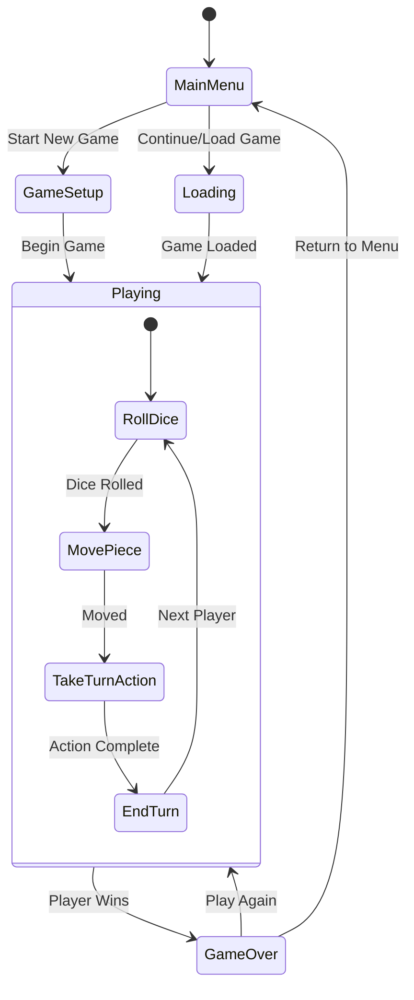
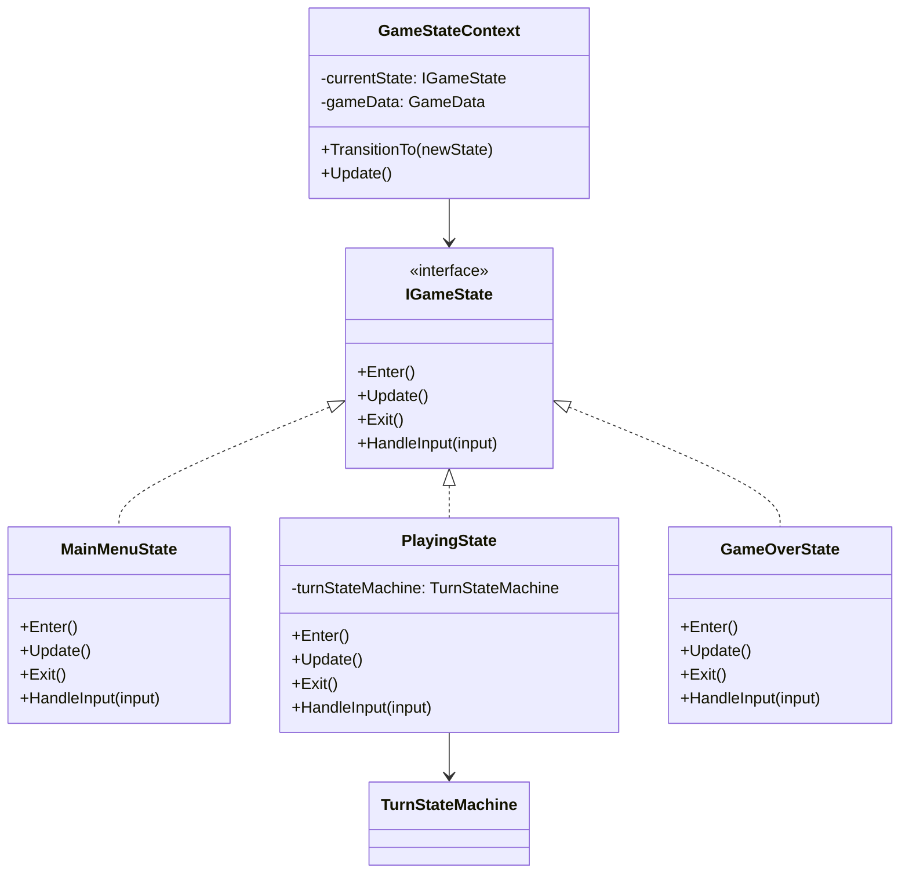
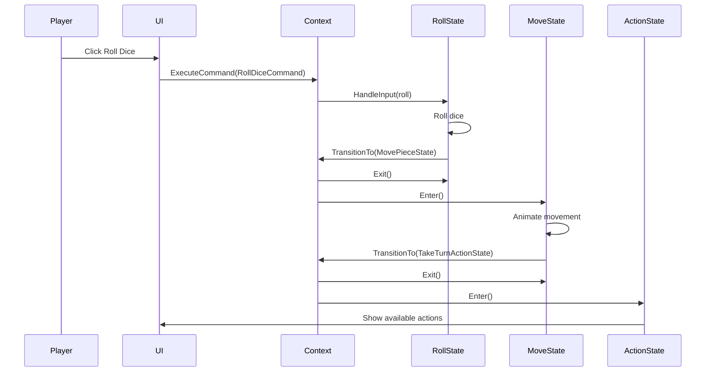

# State Machine Pattern for Monopoly Frenzy

**Date**: 2026-02-16  
**Status**: Approved  
**Related Documents**:
- [ADR-002: Game State Management](../decisions/adr-002-game-state-management.md)
- [System Overview](../architecture/monopoly-frenzy-system-overview.md)

## Overview

The State Machine pattern is used in Monopoly Frenzy to manage game flow and turn progression. This document describes the pattern implementation, when to use it, and best practices.

## Pattern Description

### Intent

Allow an object to alter its behavior when its internal state changes. The object will appear to change its class.

### Problem It Solves

In games like Monopoly, the valid actions and behaviors change depending on the current phase of the game. For example:
- In the Main Menu, you can start a game or load a saved game
- During a turn, you can roll dice, move, buy properties, etc.
- After the game ends, you can view scores or return to menu

Without a state machine, this leads to complex conditional logic scattered throughout the code (`if (gamePhase == MENU) { ... } else if (gamePhase == PLAYING) { ... }`).

### Solution

Encapsulate state-specific behavior in separate state objects. When the state changes, swap out the state object.

## Architecture Diagram



## Implementation Structure



## Monopoly Frenzy State Hierarchy

### High-Level Game States

1. **MainMenuState**
   - **Entry**: Display main menu UI
   - **Valid Actions**: Start game, continue, load game, settings, quit
   - **Exit**: Clean up menu UI
   - **Transitions To**: GameSetupState, LoadingState

2. **GameSetupState**
   - **Entry**: Show game configuration UI
   - **Valid Actions**: Configure players, select rules, choose preset
   - **Exit**: Initialize game with selected configuration
   - **Transitions To**: PlayingState

3. **LoadingState**
   - **Entry**: Show loading screen
   - **Valid Actions**: None (loading in progress)
   - **Exit**: Restore game state
   - **Transitions To**: PlayingState

4. **PlayingState**
   - **Entry**: Initialize turn system
   - **Valid Actions**: Depends on turn state (see below)
   - **Exit**: Clean up active game
   - **Transitions To**: GameOverState, PausedState

5. **PausedState**
   - **Entry**: Show pause menu
   - **Valid Actions**: Resume, save, settings, quit
   - **Exit**: Resume game time
   - **Transitions To**: PlayingState, MainMenuState

6. **GameOverState**
   - **Entry**: Calculate final scores, show results
   - **Valid Actions**: View results, return to menu, play again
   - **Exit**: Clean up game state
   - **Transitions To**: MainMenuState, GameSetupState

### Turn State Machine (Within PlayingState)

1. **RollDiceState**
   - **Entry**: Activate roll dice button
   - **Valid Actions**: Roll dice (or use get out of jail card)
   - **Exit**: Record dice roll
   - **Transitions To**: MovePieceState, JailState

2. **MovePieceState**
   - **Entry**: Animate piece movement
   - **Valid Actions**: None (animation playing)
   - **Exit**: Trigger space landing events
   - **Transitions To**: TakeTurnActionState

3. **TakeTurnActionState**
   - **Entry**: Determine available actions for landed space
   - **Valid Actions**: Buy property, pay rent, draw card, etc.
   - **Exit**: Execute player's chosen action
   - **Transitions To**: EndTurnState, AuctionState, TradeState

4. **AuctionState**
   - **Entry**: Start auction for property
   - **Valid Actions**: Bid, pass
   - **Exit**: Award property to highest bidder
   - **Transitions To**: EndTurnState

5. **TradeState**
   - **Entry**: Show trade UI
   - **Valid Actions**: Propose trade, accept, reject
   - **Exit**: Execute trade if accepted
   - **Transitions To**: TakeTurnActionState

6. **EndTurnState**
   - **Entry**: Clean up turn state
   - **Valid Actions**: None (automatic)
   - **Exit**: Advance to next player
   - **Transitions To**: RollDiceState

## When to Use State Pattern

### ✅ Use State Pattern When:

1. **Object behavior changes based on state**: Game acts differently in menu vs playing vs game over
2. **Large conditional statements**: If you have many `if/switch` statements checking state
3. **State-specific operations**: Each state has unique operations
4. **Clear state transitions**: States have well-defined entry/exit points
5. **Multiple states**: At least 3-4 distinct states

### ❌ Don't Use State Pattern When:

1. **Simple boolean flags sufficient**: If you only have 2 states (playing/paused)
2. **No state-specific behavior**: If all states do mostly the same thing
3. **Frequent state changes**: If state changes every frame (consider other patterns)
4. **States have no transitions**: If states don't flow into each other

## Benefits in Monopoly Frenzy

1. **Clear Game Flow**:
   - Visual representation of all possible game states
   - Explicit state transitions
   - Easy to understand current phase

2. **Reduced Complexity**:
   - No giant if/else blocks
   - State-specific code isolated in state classes
   - Easier to debug (know which state is active)

3. **Easier Testing**:
   - Test each state independently
   - Mock state transitions
   - Validate state-specific logic

4. **Extensibility**:
   - Add new states without modifying existing ones
   - Add new turn phases (e.g., auction, trading)
   - Support game variants with different states

5. **Save/Load Support**:
   - Save current state as string/enum
   - Restore state on load
   - Validate state is restorable

6. **Bug Prevention**:
   - Can't perform invalid actions for current state
   - State transitions are explicit and validated
   - Entry/exit guarantees prevent orphaned resources

## Implementation Guidelines

### State Interface

Each state implements a common interface:

```
IGameState Interface:
- Enter(): Called when entering this state
- Update(): Called every frame while in this state
- Exit(): Called when leaving this state
- HandleInput(input): Process user input
- ValidateTransition(toState): Check if transition is valid
```

### State Context

Context manages current state and transitions:

```
GameStateContext:
- currentState: Active state object
- gameData: Shared game data
- TransitionTo(newState): Change to new state
  1. Call currentState.Exit()
  2. Set currentState = newState
  3. Call currentState.Enter()
- Update(): Delegate to currentState.Update()
```

### Hierarchical State Machines

PlayingState contains its own TurnStateMachine:

```
PlayingState:
- turnStateMachine: Manages turn phases
- Enter(): Initialize turn state machine
- Update(): Update turn state machine
- Exit(): Clean up turn state machine
```

This allows nested state logic without mixing concerns.

## Best Practices

### 1. Single Responsibility per State

Each state should have one clear purpose:
- ✅ `RollDiceState`: Handle dice rolling
- ❌ `PlayingState`: Handle dice, movement, actions, trades, auctions (too much)

### 2. Explicit Entry and Exit

Always implement Entry and Exit methods:

```
Enter():
- Initialize UI for this state
- Set up event listeners
- Load required assets
- Log state entry for debugging

Exit():
- Clean up UI
- Unregister event listeners
- Save state if needed
- Log state exit
```

### 3. Validate Transitions

Check if transition is legal before executing:

```
ValidateTransition(toState):
- Can only go from MainMenu to GameSetup, not to Playing
- Can't go to EndTurn without completing TurnAction
- Return true if valid, false otherwise
```

### 4. Use Enums for State Types

Define enum for type-safe state references:

```
enum GamePhase:
- MainMenu
- GameSetup
- Loading
- Playing
- Paused
- GameOver

enum TurnPhase:
- RollDice
- MovePiece
- TakeTurnAction
- Auction
- Trade
- EndTurn
```

### 5. Log State Transitions

Always log transitions for debugging:

```
TransitionTo(newState):
- Log "Transitioning from {currentState} to {newState}"
- Helps debug state flow issues
- Can be disabled in release builds
```

### 6. Handle State Serialization

For save/load, states must be serializable:

```
SaveGame():
- Save currentGamePhase as enum/string
- Save currentTurnPhase
- Save player who's turn it is
- On load, reconstruct state from saved data
```

### 7. Avoid State Data Duplication

Share game data through context, don't copy to states:

```
✅ state.context.gameData.players
❌ state.players (duplicates data)
```

## Common Pitfalls to Avoid

### ❌ Forgetting Exit Cleanup

**Problem**: Resources leak when transitioning states

**Solution**: Always implement Exit() and clean up:
- Unregister events
- Destroy temporary objects
- Stop coroutines/async operations

### ❌ Tight Coupling Between States

**Problem**: States directly reference each other

**Solution**: States should only know about context, not other states:
- ✅ `context.TransitionTo(GamePhase.Playing)`
- ❌ `new PlayingState().Enter()`

### ❌ Mixing State and Data

**Problem**: Game data stored in state objects

**Solution**: States contain logic, context contains data:
- State: Behavior (what you can do)
- Context/GameData: Information (what you know)

### ❌ Too Many States

**Problem**: State explosion (100+ states)

**Solution**: Use hierarchical state machines:
- Top level: Game phase
- Second level: Turn phase
- Third level: Specific actions

### ❌ Skipping Validation

**Problem**: Invalid transitions cause bugs

**Solution**: Always validate transitions:
- Check preconditions
- Ensure current state allows transition
- Log invalid attempts

## Integration with Other Patterns

### State + Command Pattern

Commands trigger state transitions:

```
RollDiceCommand.Execute():
1. Validate current state is RollDiceState
2. Roll dice
3. Trigger transition to MovePieceState
```

### State + Observer Pattern

States publish events when changing:

```
OnStateChanged event:
- UI subscribes to update display
- Audio system plays state-specific music
- Analytics logs state transitions
```

### State + Strategy Pattern

Different strategies available per state:

```
TakeTurnActionState:
- PlayerActionStrategy (for humans)
- AIActionStrategy (for AI)
- Strategy chosen based on current player type
```

## Example: Turn State Flow



## Testing State Machines

### Unit Testing States

Test each state in isolation:

```
Test: RollDiceState_ValidRoll_TransitionsToMove
- Arrange: Create RollDiceState with mock context
- Act: HandleInput with roll command
- Assert: Context.TransitionTo called with MovePieceState

Test: RollDiceState_InJail_StaysInRoll
- Arrange: RollDiceState, player in jail
- Act: HandleInput with roll that doesn't get doubles
- Assert: No transition, player stays in jail
```

### Integration Testing Transitions

Test state flow:

```
Test: CompleteTurn_HappyPath
1. Start in RollDiceState
2. Roll dice
3. Verify transition to MovePieceState
4. Complete movement
5. Verify transition to TakeTurnActionState
6. Complete action
7. Verify transition to EndTurnState
8. Verify transition to RollDiceState for next player
```

### Testing Invalid Transitions

Ensure invalid transitions are rejected:

```
Test: CannotSkipToEndTurn
- Arrange: Currently in RollDiceState
- Act: Attempt to transition to EndTurnState
- Assert: Transition rejected, still in RollDiceState
```

## Performance Considerations

### State Pattern Performance

**Overhead**: Minimal
- One virtual method call per frame (Update)
- State object allocation (negligible)
- Transition overhead (only on state changes)

**For Monopoly Frenzy**: State pattern overhead is unmeasurable compared to rendering and game logic.

### Optimization Tips

1. **Cache State Objects**: Reuse state instances instead of creating new ones
2. **Lazy Initialization**: Only create states when first needed
3. **State Pooling**: Pool state objects if creating many temporary states
4. **Avoid State Thrashing**: Don't switch states every frame

For turn-based game like Monopoly, none of these optimizations are necessary.

## Examples from Successful Games

### Civilization VI

**State Machine Usage**:
- High-level: Main Menu, Loading, Playing, Diplomacy, Victory
- Turn-level: Player Turn, AI Turn, Between Turns
- Combat: Declare War, Move Units, Attack, Resolve

**Lesson**: Hierarchical state machines for complex games

### XCOM 2

**State Machine Usage**:
- Strategic Layer (Geoscape): Base Management, Research, Squad Setup
- Tactical Layer (Mission): Deploy, Turn, Action, Overwatch, Enemy Turn
- Each soldier has state: Idle, Moving, Shooting, Taking Cover

**Lesson**: Multiple independent state machines for different subsystems

### Hearthstone

**State Machine Usage**:
- Match Flow: Mulligan, Player Turn, Opponent Turn, End Game
- Action: Planning, Playing Card, Resolving, Waiting
- Card: In Hand, On Board, In Graveyard

**Lesson**: Clear states prevent impossible game situations

## Conclusion

The State Machine pattern is ideal for Monopoly Frenzy because:
- ✅ Clear separation between game phases
- ✅ Natural fit for turn-based gameplay
- ✅ Easy to visualize and debug
- ✅ Supports save/load requirements
- ✅ Extensible for new game modes

## References

- **Book**: "Game Programming Patterns" by Robert Nystrom (Chapter: State)
- **Book**: "Design Patterns" by Gang of Four
- **Article**: "Finite State Machines in Games" (Game AI Pro)
- **GDC Talk**: "State Machines in Game Development"
- **Unity Manual**: Animator State Machines (similar concepts)

## Revision History

| Date | Version | Changes | Author |
|------|---------|---------|--------|
| 2026-02-16 | 1.0 | Initial pattern documentation | Software Architect Agent |

